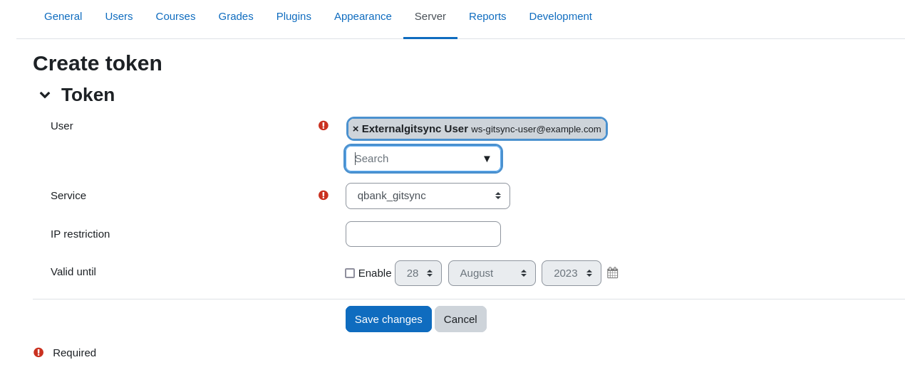
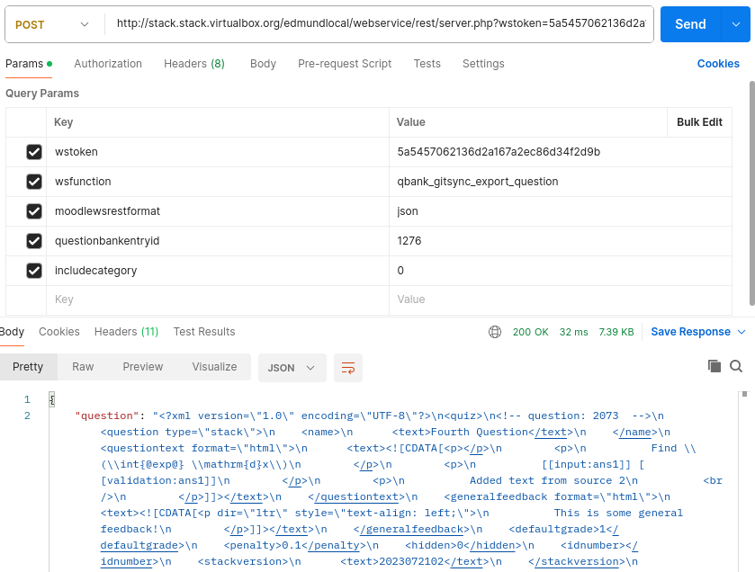

# Setting up the Moodle webservice

There are two parts to installing gitsync.

1. Install the plugin on Moodle and [set up the webservice](webservicesetup.md).
2. Set up Git, PHP and the plugin scripts [on your local computer](localsetup.md).

This plugin requires the [import as new version](https://github.com/maths/moodle-qbank_importasversion) plugin as well.

- Add the gitsync plugin to Moodle.  E.g. from the moodle directory clone the code as follows:  
    `git clone https://github.com/maths/moodle-qbank_gitsync.git question/bank/gitsync`
- The repository will default to the `main` branch but you may need to switch to another branch if you're testing new features (e.g. `dev` for initial beta testing). In the gitsync directory e.g. `git checkout dev`.  
- Install the plugin via Moodle.
- Run the setup script in the gitsync cli folder (`yourmoodle/question/bank/gitsync/cli/`) on the Moodle server if you have access:
  - `php webservicesetup.php`
- Alternatively, perform user set up manually:
  - Create a user `ws-gitsync-user`. (Site administration/Users/Add a new user; Username: ws-gitsync-user, First name: Externalgitsync,
    Last name: User)
  - Create a role `ws-gitsync-role`. (Site administration/Users/Permissions/Define roles; Use role: No role, Custom full name: WS Role for Externalgitsync, Short name: ws-gitsync-role)
  - The role should have capabilities `webservice/rest:use`, `qbank/gitsync:importquestions`, `qbank/gitsync:exportquestions`, `qbank/gitsync:deletequestions` and `qbank/gitsync:listquestions`. These can be added on role setup or via Site administration/User/Permissions/Define roles/Cog icon.
  - Assigned the role to the user. (Site administration/User/Permissions/Assign system roles)
  - Enable the webservice (Site administration/Server/Web services/External services/qbank_gitsync/Edit) and on the same page 'Show more...' and enable file upload within the webservice.
  - Authorise the user to use the service. (Site administration/Server/Web services/External services/qbank_gitsync/Authorised users)
- Go to Site administration/Server/Web services/Manage tokens in Moodle and create a token for the user `ws-gitsync-user`.

- Add roles for the user to give them access to the required courses and questions. If you would like them to have site-wide access, go to Site Administration/Users/Permissions/Assign system roles and give `ws-gitsync-user` Manager role for the webservice to have access to all questions on the site.  If you only want them to have access to particular courses, then make `ws-gitsync-user` Manager on courses individually.
- If you have user agreements set up for your Moodle site, you will need to accept them on behalf of the Gitsync user. (Site Administration/Users/Privacy and policies/Manage policies/Agreements/Accept)
- Optionally, you can test using [Postman](https://www.postman.com/downloads/) if you know a question id and its course name:
  - URL: Your_Moodle_root_address/webservice/rest/server.php
  - Params:
    - wstoken: _Your token created above_
    - wsfunction: qbank_gitsync_export_question
    - moodlewsrestformat: json
    - questionid: _Your question id_
    - contextlevel: 10
    - coursename: _Your course name_
    - modulename:
    - coursecategory:  
Fill in the URL and parameters above in the fields as shown in the screenshot and click 'Send'. You should get the requested question back as a response.

## Additional security
The token essentially allows question export, import and delete for all contexts for which the webservice user has question edit permissions. It's like a manager password but less obscured - be careful! Restrict the contexts the user has access to for added security and to reduce the chance of user error. **Also create severely limited lifespan tokens and/or restrict the valid IP address.** You can have multiple tokens, each for a different IP address to allow access for different colleagues/computers. 